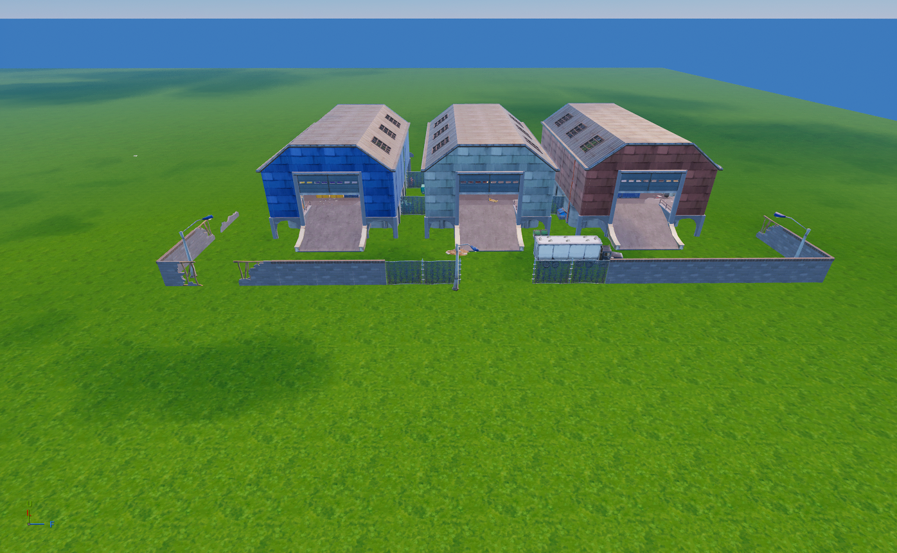

**[🔙 Back To Table of Contents]([/Table%20of%20Contents.md](https://github.com/MechanicPlaysFR/Fortnite-UEFN-POIs.git))**

# 🗺️ Fortnite Chapter 1 Points of Interest (POIs)

This page contains the most iconic and popular POIs from Fortnite Chapter 1 Island — fully organized with images and names for easy browsing.
---

## 🏝️ Moisty Mire

| Icon | POI Name | Description |
|------|----------|-------------|
|  | Moisty Mire | Swampy area with lots of trees and water, great for ambushes. |

---

## 🏞️ Wailing Woods

| Icon | POI Name | Description |
|------|----------|-------------|
|  | Wailing Woods | Dense forest featuring a maze and hidden cabins. |

---

## 🏜️ Greasy Grove

| Icon | POI Name | Description |
|------|----------|-------------|
|  | Paradise Palms | Desert-themed POI with hotels and shops, open layouts. |

---

## 🏚️ Dusty Depot

| Icon | POI Name | Description |
|------|----------|-------------|
|  | **[Dusty Depot](https://github.com/MechanicPlaysFR/Fortnite-UEFN-POIs/blob/46b1991ac9190375f245b0106125dda986e8ac86/SpawnerTexts/Dusty%20OG.txt)** **(Ported by: MCPS)**  **Source: Chapter 1 Island** | Visually Modified: ✔️ Requires External Download: ❌|

---

## 🏡 Pleasant Park

| Icon | POI Name | Description |
|------|----------|-------------|
|  | **[Pleasant Park](https://github.com/MechanicPlaysFR/Fortnite-UEFN-POIs/blob/b4c54406aad978eaa260db168d88c1645d199338/SpawnerTexts/Pleasent_Park_CH1.txt)** **(Ported by: HomeroTodano)**  **Source: Chapter 1 Island** | Visually Modified: ✔️ Requires External Download: ❌|

---

## 🏗️ Retail Row

| Icon | POI Name | Description |
|------|----------|-------------|
|  | Retail Row | Shopping district with stores and houses. |

---

## 🚤 Loot Lake

| Icon | POI Name | Description |
|------|----------|-------------|
|  | Loot Lake | Central lake with an island and various buildings. |

---

## 🏜️ Salty Springs

| Icon | POI Name | Description |
|------|----------|-------------|
|  | **[Salty Springs](https://github.com/MechanicPlaysFR/Fortnite-UEFN-POIs/blob/5528ef25d8901fafaa1988184fdae8da4132ae9e/SpawnerTexts/Salty_Springs%20(1).txt)** **(Ported by: HomeroTodano)**  **Source: Chapter 1 Island** | Visually Modified: ✔️ Requires External Download: ❌|

---

## 🏭 Tomato Town

| Icon | POI Name | Description |
|------|----------|-------------|
|  | Tomato Town | Small town with fast looting and tight fights. |

---

## 🎡 Flush Factory

| Icon | POI Name | Description |
|------|----------|-------------|
|  | Junk Junction | Large scrapyard with junk piles and containers. |

---

## 🏕️ Anarchy Acres

| Icon | POI Name | Description |
|------|----------|-------------|
|  | Haunted Hills | Graveyard-themed POI with spooky buildings. |

---
## 🏕️ Fatal Fields

| Icon | POI Name | Description |
|------|----------|-------------|
|  | Haunted Hills | Graveyard-themed POI with spooky buildings. |

---
## 🏕️ Lonely Ledge

| Icon | POI Name | Description |
|------|----------|-------------|
|  | Haunted Hills | Graveyard-themed POI with spooky buildings. |

---
## 🏛️ Spawn Island

| Icon | POI Name | Description |
|------|----------|-------------|
|  | Spawn Island | The pre-game lobby island where all players start. |

---

## 🔧 How To Use This Page

- Browse the images and POI names for inspiration or nostalgia  
- Use this as a reference to build or design your own versions in UEFN  
- Great for map creators who want authentic Chapter 1 vibe locations

---

## 🧾 Credits

All images and POI info compiled for easy reference — inspired by Fortnite’s original map design.
