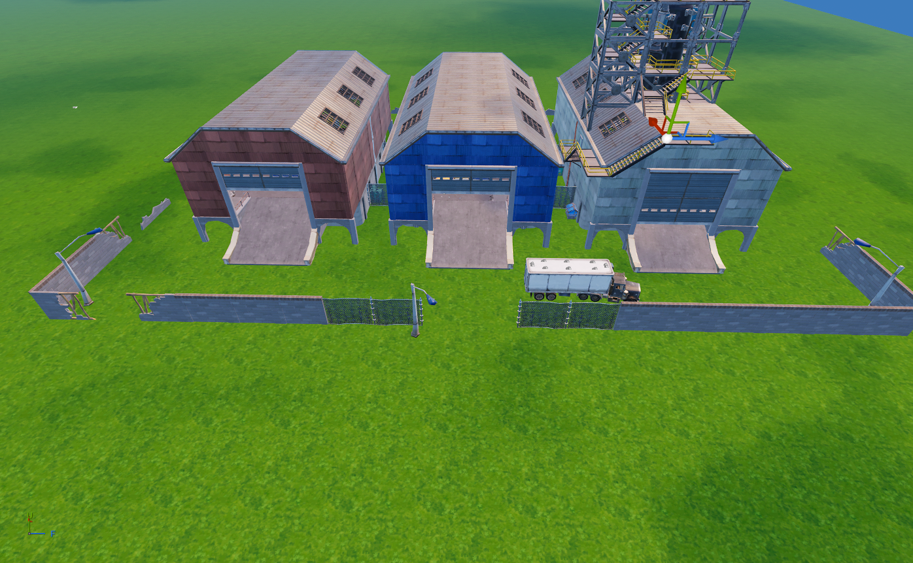

## 🏛️ Moisty Palms

| Icon | POI Name | Description |
|------|----------|-------------|
|  | Spawn Island | The pre-game lobby island where all players start. |

---
## 🏛️ Greasy Grove

| Icon | POI Name | Description |
|------|----------|-------------|
|  | Spawn Island | The pre-game lobby island where all players start. |

---
## 🏛️ Dusty Depot (Rocket)

| Icon | POI Name | Description |
|------|----------|-------------|
|  | **[Dusty Depot (Rocket)](https://github.com/MechanicPlaysFR/Fortnite-UEFN-POIs/blob/5b057bdfd8606af5faca2f905428a0afce77dfde/SpawnerTexts/Dusty%2010.3.txt)** **(Ported by: MCPS)**  **Source: Chapter 1 Island** | Visually Modified: ✔️ Requires External Download: ❌|

---
## 🔧 How To Use This Page

- Browse the images and POI names for inspiration or nostalgia  
- Use this as a reference to build or design your own versions in UEFN  
- Great for map creators who want authentic Chapter 1 vibe locations

---

## 🧾 Credits

All images and POI info compiled for easy reference — inspired by Fortnite’s original map design.
