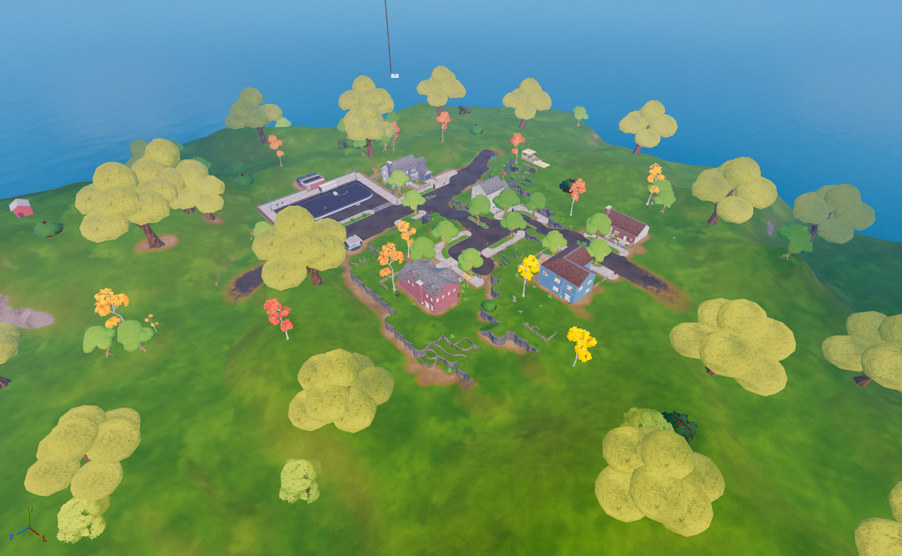

---

# 🌍 Fortnite Chapter 2 Points of Interest (POIs)

New island, new mechanics, and new iconic POIs that defined the Chapter 2 era. This list captures the most well-known Chapter 2 locations with images and short descriptions.

---

## 🧱 Lazy Lake

| Icon | POI Name | Description |
|------|----------|-------------|
|  | **[Lazy Lake](https://github.com/MechanicPlaysFR/Fortnite-UEFN-POIs/blob/320bca872cbed198d93a4c88f50ad79601c81fda/SpawnerTexts/12_S12_Lazy_Lake_Full_POI_cHSVDAfieIqX.txt)** **(Ported by: MCPS)**  **Source: Chapter 2 Island** | Visually Modified: âœ”ï¸ Requires External Download: ❌|
---

## 🏚️ Slurpy Swamp

| Icon | POI Name | Description |
|------|----------|-------------|
|  | **[Slurpy Swamp](https://github.com/MechanicPlaysFR/Fortnite-UEFN-POIs/blob/0bded4e8a1ce4a29da7546e9edb1197b3eb6c3c1/SpawnerTexts/11_Full_Slurpy_Swamp_ngRpLKI97JTh.txt)** **(Ported by: MCPS)**  **Source: Chapter 2 Island** | Visually Modified: âœ”ï¸ Requires External Download: ❌|
---

## 🛫 Steamy Stacks

| Icon | POI Name | Description |
|------|----------|-------------|
|  | **[Steamy Stacks](https://github.com/MechanicPlaysFR/Fortnite-UEFN-POIs/blob/d594df86822bc61cf7a6f2a963bf1a92d2f0d06e/SpawnerTexts/Steamy%20Stacks.txt)** **(Ported by: MCPS)**  **Source: Chapter 2 Island** | Visually Modified: âœ”ï¸ Requires External Download: ❌|

---

## 🎯 Frenzy Farm

| Icon | POI Name | Description |
|------|----------|-------------|
|  | Frenzy Farm | Open farmland perfect for long-range combat and loot. |

---

## 🎣 Misty Meadows

| Icon | POI Name | Description |
|------|----------|-------------|
|  | **[Misty Meadows](https://github.com/MechanicPlaysFR/Fortnite-UEFN-POIs/blob/eb6547a220e71ffeef38a5260aca564716c31aba/SpawnerTexts/11_Full_Misty_Meadows_RWuCAOoSrmKJ.txt)** **(Ported by: MCPS)**  **Source: Chapter 2 Island** | Visually Modified: âœ”ï¸ Requires External Download: ❌|

---

## 🛒 Retail Row 

| Icon | POI Name | Description |
|------|----------|-------------|
|  | **[Retail Row](https://github.com/MechanicPlaysFR/Fortnite-UEFN-POIs/blob/b39c7ffcdccf84d6762c686b8e9122dd5653722b/SpawnerTexts/Retail%20Row%20CH%202.txt)** **(Ported by: MCPS)**  **Source: Chapter 2 Island** | Visually Modified: âœ”ï¸ Requires External Download: ❌|
---

## 🏕️ Weeping Woods

| Icon | POI Name | Description |
|------|----------|-------------|
|  | Weeping Woods | Forested POI with cabins, tall trees, and hiding spots. |

---

## 🛰️ Dirty Docks

| Icon | POI Name | Description |
|------|----------|-------------|
|  | **[Dirty Docks](https://github.com/MechanicPlaysFR/Fortnite-UEFN-POIs/blob/320bca872cbed198d93a4c88f50ad79601c81fda/SpawnerTexts/Dirty%20Docks.txt)** **(Ported by: MCPS)**  **Source: Chapter 2 Island** | Visually Modified: âœ”ï¸ Requires External Download: ❌|

---

## 🧱 Holly Hedges

| Icon | POI Name | Description |
|------|----------|-------------|
|  | **[Holly Hedges](https://github.com/MechanicPlaysFR/Fortnite-UEFN-POIs/blob/b045f45f6c40fddab482bd04a56b19fb70cf95cc/SpawnerTexts/Holley%20Hedges.txt)** **(Ported by: MCPS)**  **Source: Chapter 2 Island** | Visually Modified: âœ”ï¸ Requires External Download: ❌|

---
## 🌀 Pleasant Park

| Icon | POI Name | Description |
|------|----------|-------------|
|  | **[Pleasant Park](https://github.com/MechanicPlaysFR/Fortnite-UEFN-POIs/blob/edbbe16a50d9cf4af4780b12cd3869701075b054/SpawnerTexts/Pleasent%20Park%20CH%202.txt)** **(Ported by: MCPS)**  **Source: Chapter 2 Island** | Visually Modified: âœ”ï¸ Requires External Download: ❌|
---
## 🌀 Salty Springs

| Icon | POI Name | Description |
|------|----------|-------------|
|  | **[Salty Springs](https://github.com/MechanicPlaysFR/Fortnite-UEFN-POIs/blob/f7b7d364ef6984f3e442d705d3467c7c77428a42/SpawnerTexts/Salty%20Springs%20CH%202.txt)** **(Ported by: MCPS)**  **Source: Chapter 2 Island** | Visually Modified: âœ”ï¸ Requires External Download: ❌|

---
## 🌀 Risky Reels

| Icon | POI Name | Description |
|------|----------|-------------|
|  | **[Risky Reels](https://github.com/MechanicPlaysFR/Fortnite-UEFN-POIs/blob/0ce59fdbdf2667d78c31f243d6767c8ef48a0425/SpawnerTexts/Prefab_VariantRiskyReels_POI.txt)** **(Ported by: Lady Miranda)**  **Source: Chapter 2 Island** | Visually Modified: âœ”ï¸ Requires External Download: ❌|

---
## 🔧 How To Use This Page

- Browse the POIs visually or search by name  
- Use it to plan your creative builds, UEFN recreations, or nostalgic maps  
- Inspired by Chapter 2's evolving storyline and unique locations

---

## 🧾 Credits

All POI images and information compiled by the community for Creative & UEFN builders.
