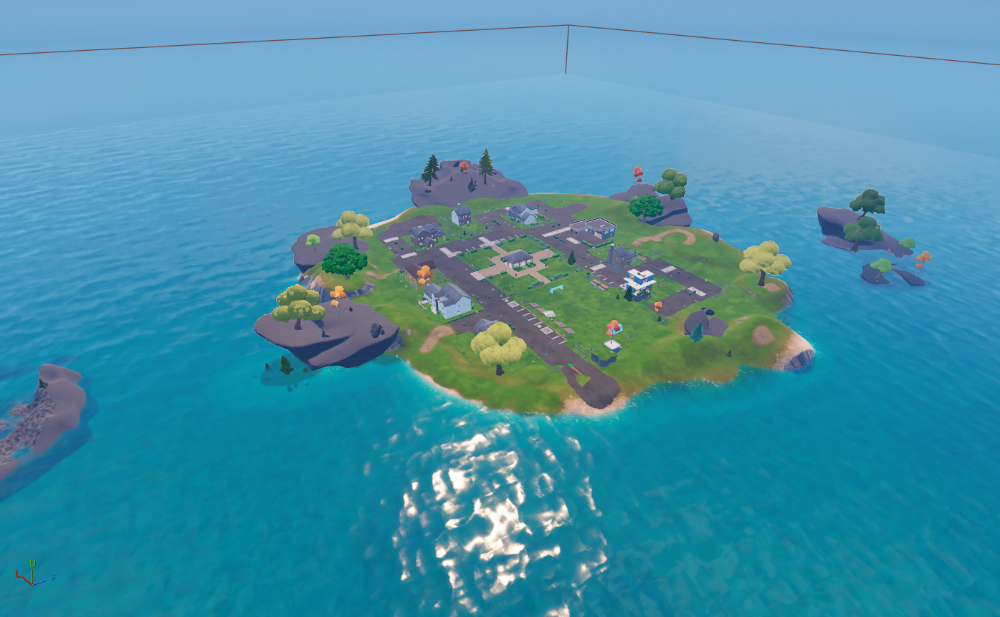
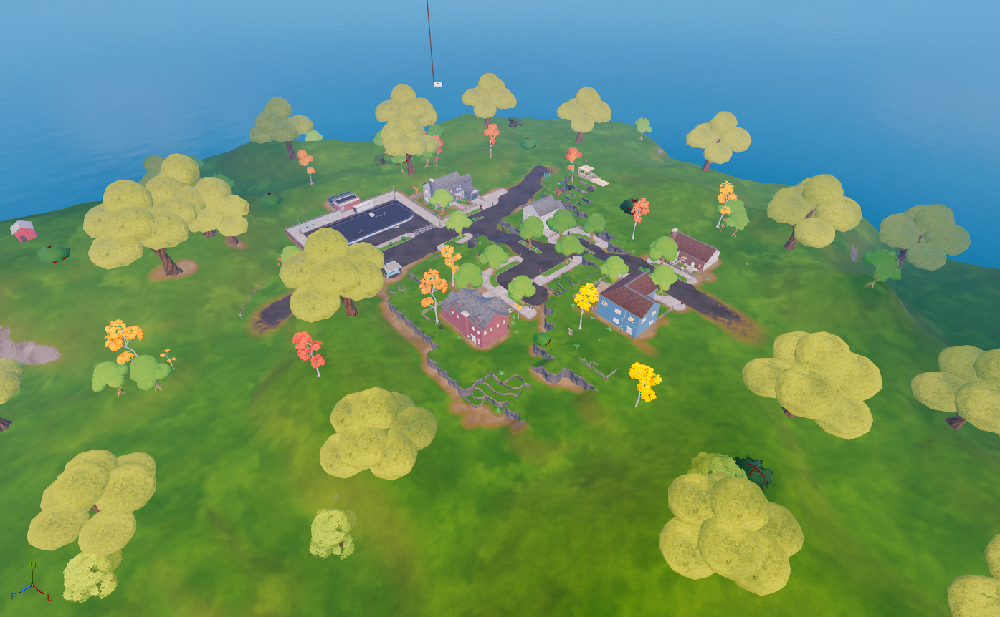

##  The Shark

| Icon | POI Name | Description |
|------|----------|-------------|
|   | **[The Shark](https://github.com/MechanicPlaysFR/Fortnite-UEFN-POIs/blob/956e1038012592e78999e295cd15c5c06c5f44ec/SpawnerTexts/The%20Shark.txt)** **(Ported by: MCPS)**  **Source: Chapter 2 Island** | Visually Modified: ✔️ Requires External Download: ❌|
---

## The Rig

| Icon | POI Name | Description |
|------|----------|-------------|
|  | Dirty Docks | Large industrial dockyard with cranes and dense loot. |

---

## 🧱 The Agency

| Icon | POI Name | Description |
|------|----------|-------------|
|  | Holly Hedges | Suburban zone with tight house fights and garden loot. |

---
## 🌀 The Yacht

| Icon | POI Name | Description |
|------|----------|-------------|
|  | **[Pleasant Park](https://github.com/MechanicPlaysFR/Fortnite-UEFN-POIs/blob/edbbe16a50d9cf4af4780b12cd3869701075b054/SpawnerTexts/Pleasent%20Park%20CH%202.txt)** **(Ported by: MCPS)**  **Source: Chapter 2 Island** | Visually Modified: ✔️ Requires External Download: ❌|
---
🌀 The Gorotto

| Icon | POI Name | Description |
|------|----------|-------------|
|  | **[Salty Springs](https://github.com/MechanicPlaysFR/Fortnite-UEFN-POIs/blob/f7b7d364ef6984f3e442d705d3467c7c77428a42/SpawnerTexts/Salty%20Springs%20CH%202.txt)** **(Ported by: MCPS)**  **Source: Chapter 2 Island** | Visually Modified: ✔️ Requires External Download: ❌|
---
🌀 Pleasant Park (Underground)

| Icon | POI Name | Description |
|------|----------|-------------|
|  | **[Salty Springs](https://github.com/MechanicPlaysFR/Fortnite-UEFN-POIs/blob/f7b7d364ef6984f3e442d705d3467c7c77428a42/SpawnerTexts/Salty%20Springs%20CH%202.txt)** **(Ported by: MCPS)**  **Source: Chapter 2 Island** | Visually Modified: ✔️ Requires External Download: ❌|
---
## 🔧 How To Use This Page

- Browse the POIs visually or search by name  
- Use it to plan your creative builds, UEFN recreations, or nostalgic maps  
- Inspired by Chapter 2's evolving storyline and unique locations

---

## 🧾 Credits

All POI images and information compiled by the community for Creative & UEFN builders.
