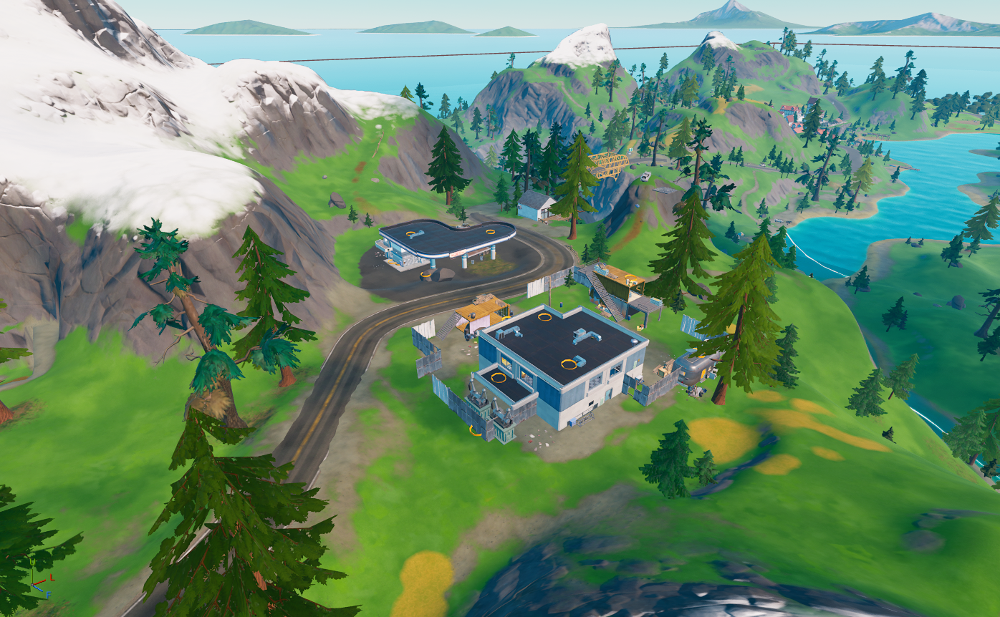

##  Fortilla
| Icon | POI Name | Description |
|------|----------|-------------|
|   | **[The Fortilla](https://github.com/MechanicPlaysFR/Fortnite-UEFN-POIs/blob/a417d1b3e398b3adae16bd7be28bc9b6c0be462d/SpawnerTexts/13_Fortilla_FULL_POI_a63joVRxDPch.txt)** **(Ported by: MCPS)**  **Source: Chapter 2 Island** | Visually Modified: ✔️ Requires External Download: ❌|
---
## 🏡 The Shark (Destroyed)
| Icon | POI Name | Description |
|------|----------|-------------|
|  | Pleasant Park | Residential suburb with houses and a central park. |
---
## 🏡 Rickety Rig
| Icon | POI Name | Description |
|------|----------|-------------|
|  | Pleasant Park | Residential suburb with houses and a central park. |
---
## 🏡 Catty Corner
| Icon | POI Name | Description |
|------|----------|-------------|
|  | **[Catty Corner](https://github.com/MechanicPlaysFR/Fortnite-UEFN-POIs/blob/e90906e37fe82215a20da7193990400e233dbabb/SpawnerTexts/13_Catty_gas_and_box_factory_XqZSm24fPxnY.txt)** **(Ported by: MCPS)**  **Source: Chapter 2 Island** | Visually Modified: ✔️ Requires External Download: ❌|
---
## 🏡 The Authority
| Icon | POI Name | Description |
|------|----------|-------------|
|  | Pleasant Park | Residential suburb with houses and a central park. |

## 🔧 How To Use This Page

- Browse the images and POI names for inspiration or nostalgia  
- Use this as a reference to build or design your own versions in UEFN  
- Great for map creators who want authentic Chapter 1 vibe locations

---

## 🧾 Credits

All images and POI info compiled for easy reference — inspired by Fortnite’s original map design.

