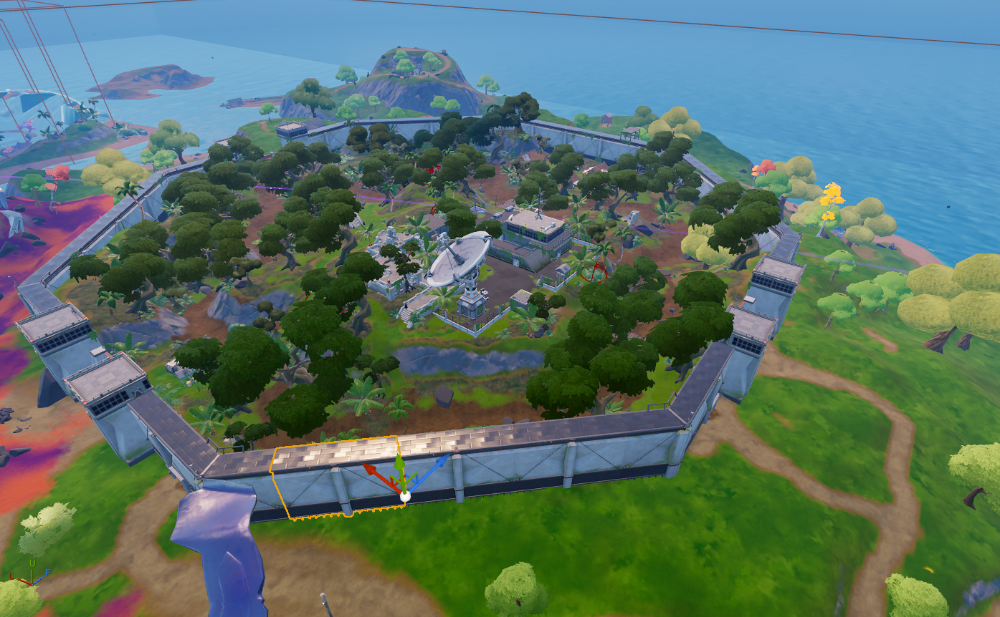
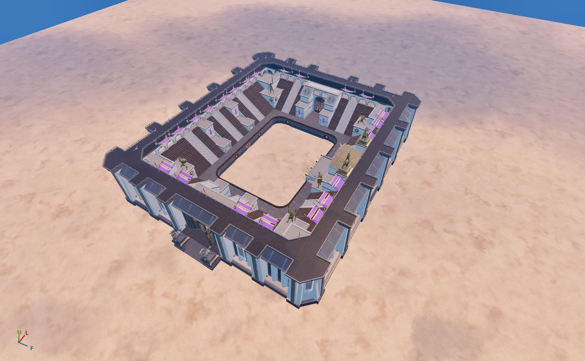

## 🏡 Salty Towers
| Icon | POI Name | Description |
|------|----------|-------------|
|  | Pleasant Park | Residential suburb with houses and a central park. |
---
## 🏡 Stealthy Stronghold
| Icon | POI Name | Description |
|------|----------|-------------|
|  | **[Stealthy Stronghold](https://github.com/MechanicPlaysFR/Fortnite-UEFN-POIs/blob/f5002800d27696ead410f8a636a97a8249237e3f/SpawnerTexts/Stealthy%20Stronghold.txt)** **(Ported by: MCPS)**  **Source: Chapter 2 Island** | Visually Modified: ✔️ Requires External Download: ❌|
---
## 🏡 Colossal Coliseum
| Icon | POI Name | Description |
|------|----------|-------------|
|  | **[Colossal Coliseum](https://github.com/MechanicPlaysFR/Fortnite-UEFN-POIs/blob/247ea47de6804ef3c469c82c44706928ee590583/SpawnerTexts/Colossal%20Coliseum.txt)** **(Ported by: MCPS)**  **Source: Chapter 2 Island** | Visually Modified: ✔️ Requires External Download: ❌|
---
---

## 🔧 How To Use This Page

- Browse the images and POI names for inspiration or nostalgia  
- Use this as a reference to build or design your own versions in UEFN  
- Great for map creators who want authentic Chapter 1 vibe locations

---

## 🧾 Credits

All images and POI info compiled for easy reference — inspired by Fortnite’s original map design.

