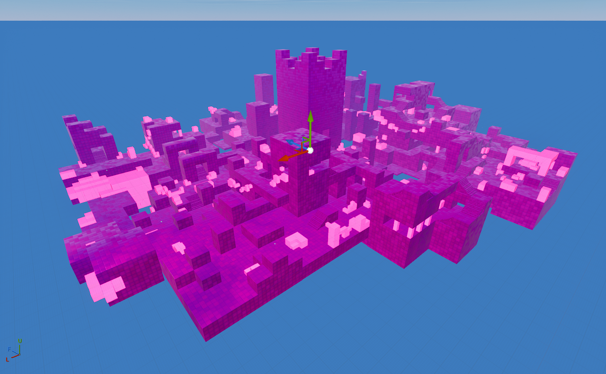

## 🏡 The Convergence
| Icon | POI Name | Description |
|------|----------|-------------|
|  | **[The Convergence](https://github.com/MechanicPlaysFR/Fortnite-UEFN-POIs/blob/630e9b7968aa63a1c055b1919c2369f304493081/SpawnerTexts/Cube%20Town.txt)** **(Ported by: HomeroTodano)**  **Source: Chapter 1 Island** | Visually Modified: ✔️ Requires External Download: ❌|
---

## 🔧 How To Use This Page

- Browse the images and POI names for inspiration or nostalgia  
- Use this as a reference to build or design your own versions in UEFN  
- Great for map creators who want authentic Chapter 1 vibe locations

---

## 🧾 Credits

All images and POI info compiled for easy reference — inspired by Fortnite’s original map design.

