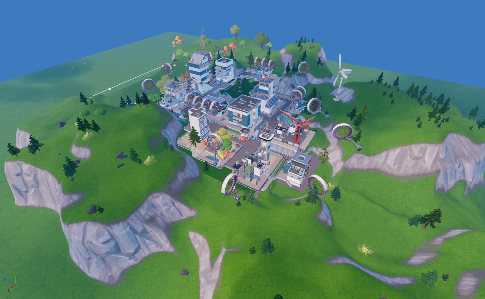

## 🏛️ Neo Tilted

| Icon | POI Name | Description |
|------|----------|-------------|
|  | **[Neo Tilted](https://github.com/MechanicPlaysFR/Fortnite-UEFN-POIs/blob/8a602f4cdf8a02b0e65d87587a953bd6dd5fbd03/SpawnerTexts/NEO_TILTED.txt)** **(Ported by: MCPS)**  **Source: Chapter 1 Island** | Visually Modified: ✔️ Requires External Download: ❌|
---
## 🏛️ Mega Mall
| Icon | POI Name | Description |
|------|----------|-------------|
|  | Spawn Island | The pre-game lobby island where all players start. |
---
## 🏛️ Pressure Plant

| Icon | POI Name | Description |
|------|----------|-------------|
|  | Spawn Island | The pre-game lobby island where all players start. |
---

## 🔧 How To Use This Page

- Browse the images and POI names for inspiration or nostalgia  
- Use this as a reference to build or design your own versions in UEFN  
- Great for map creators who want authentic Chapter 1 vibe locations

---

## 🧾 Credits

All images and POI info compiled for easy reference — inspired by Fortnite’s original map design.
