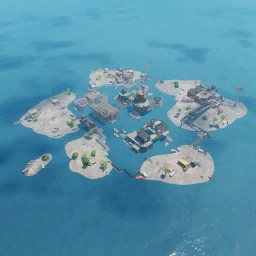

---

# 🌍 Fortnite Chapter 2 Points of Interest (POIs)

New island, new mechanics, and new iconic POIs that defined the Chapter 2 era. This list captures the most well-known Chapter 2 locations with images and short descriptions.

---

## 🧱 Lazy Lake

| Icon | POI Name | Description |
|------|----------|-------------|
|  | Lazy Lake | A busy city-style POI with modern houses, loot, and chaos. |

---

## 🐟 Coral Castle

| Icon | POI Name | Description |
|------|----------|-------------|
|  | Coral Castle | Underwater ruins with vertical gameplay and fishy vibes. |

---

## ⛽ Catty Corner

| Icon | POI Name | Description |
|------|----------|-------------|
|  | Catty Corner | Gas station hideout with a vault and boss fights in Season 3. |

---

## 🏚️ Slurpy Swamp

| Icon | POI Name | Description |
|------|----------|-------------|
|  | Slurpy Swamp | Slurp juice factory with healing water and shield strategy. |

---

## 🛫 Steamy Stacks

| Icon | POI Name | Description |
|------|----------|-------------|
|  | Steamy Stacks | Power plant with vertical ziplines and reactor stacks. |

---

## 🎯 Frenzy Farm

| Icon | POI Name | Description |
|------|----------|-------------|
|  | Frenzy Farm | Open farmland perfect for long-range combat and loot. |

---

## 🎣 Misty Meadows

| Icon | POI Name | Description |
|------|----------|-------------|
|  | Misty Meadows | Twin Alpine-style town with bridges and water-based combat. |

---

## 🏰 The Agency

| Icon | POI Name | Description |
|------|----------|-------------|
|  | The Agency / The Authority | Central island base with bosses, vaults, and intense fights. |

---

## 🛒 Retail Row (Returned)

| Icon | POI Name | Description |
|------|----------|-------------|
|  | Retail Row | Returned from Chapter 1, still packed with loot and action. |

---

## 🏕️ Weeping Woods

| Icon | POI Name | Description |
|------|----------|-------------|
|  | Weeping Woods | Forested POI with cabins, tall trees, and hiding spots. |

---

## 🛰️ Dirty Docks

| Icon | POI Name | Description |
|------|----------|-------------|
|  | Dirty Docks | Large industrial dockyard with cranes and dense loot. |

---

## 🧱 Holly Hedges

| Icon | POI Name | Description |
|------|----------|-------------|
|  | Holly Hedges | Suburban zone with tight house fights and garden loot. |

---

## The Shark

| Icon | POI Name | Description |
|------|----------|-------------|
|  | **[The Shark](https://github.com/MechanicPlaysFR/Fortnite-UEFN-POIs/blob/af783766c630c8208c420f92922f1f4758f75a96/SpawnerTexts/The%20Shark.txt)** **(Ported by: MCPS)**  **Source: Chapter 2 Island** | Visually Modified: ✔️ Requires External Download: ❌|

---

##  Fortilla

| Icon | POI Name | Description |
|------|----------|-------------|
|   | **[The Fortilla](https://github.com/MechanicPlaysFR/Fortnite-UEFN-POIs/blob/a417d1b3e398b3adae16bd7be28bc9b6c0be462d/SpawnerTexts/13_Fortilla_FULL_POI_a63joVRxDPch.txt)** **(Ported by: MCPS)**  **Source: Chapter 2 Island** | Visually Modified: ✔️ Requires External Download: ❌|

---

## 🌀 The Spire

| Icon | POI Name | Description |
|------|----------|-------------|
|  | The Spire | Towered temple in the middle of the island with Guardians. |

---

## 🌀 Salty Towers

| Icon | POI Name | Description |
|------|----------|-------------|
|  | The Spire | Towered temple in the middle of the island with Guardians. |

---
## 🌀 Catty Corner

| Icon | POI Name | Description |
|------|----------|-------------|
|  | The Spire | Towered temple in the middle of the island with Guardians. |

---
## 🌀 Pleasent Park

| Icon | POI Name | Description |
|------|----------|-------------|
|  | **[Pleasent Park](https://github.com/MechanicPlaysFR/Fortnite-UEFN-POIs/blob/edbbe16a50d9cf4af4780b12cd3869701075b054/SpawnerTexts/Pleasent%20Park%20CH%202.txt)** **(Ported by: MCPS)**  **Source: Chapter 2 Island** | Visually Modified: ✔️ Requires External Download: ❌|

---
## 🔧 How To Use This Page

- Browse the POIs visually or search by name  
- Use it to plan your creative builds, UEFN recreations, or nostalgic maps  
- Inspired by Chapter 2's evolving storyline and unique locations

---

## 🧾 Credits

All POI images and information compiled by the community for Creative & UEFN builders.
