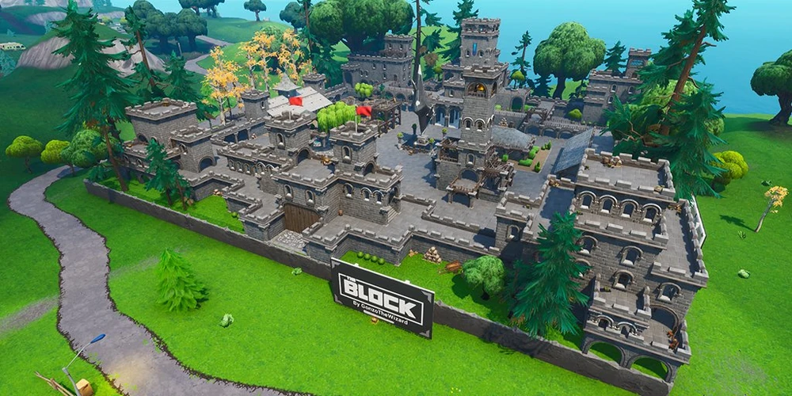
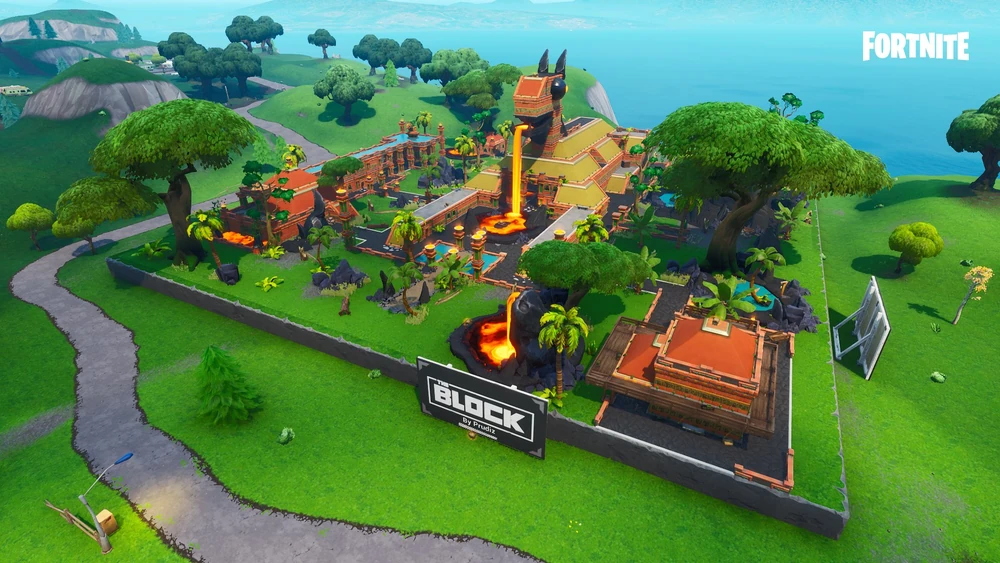
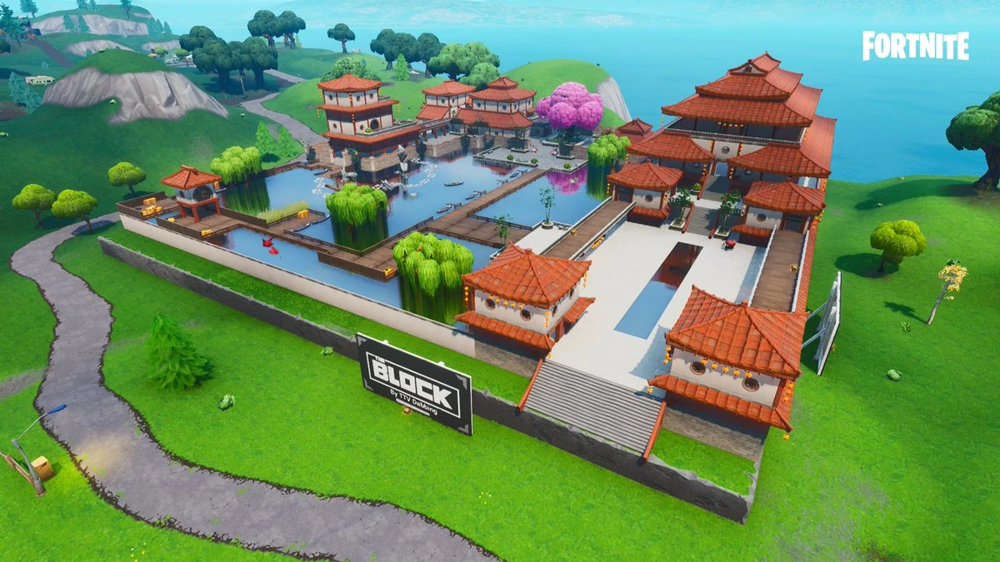
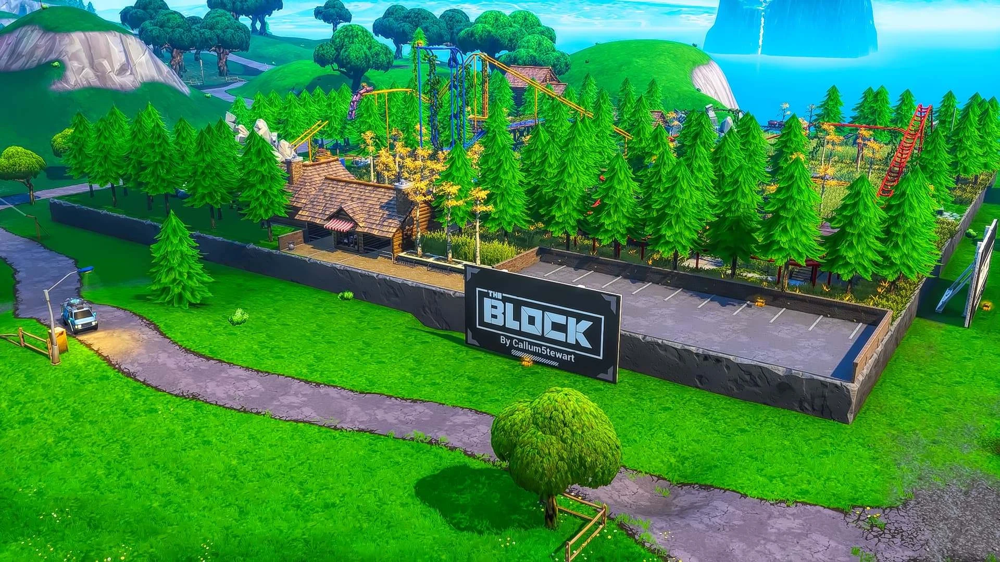
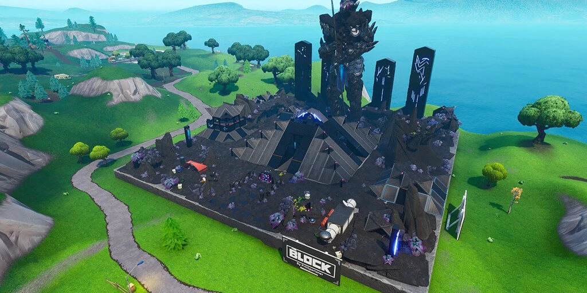

## 🏛️ Pandora

| Icon | POI Name | Description |
|------|----------|-------------|
|  | **[Pandora](https://github.com/MechanicPlaysFR/Fortnite-UEFN-POIs/blob/da97a50ea99a67669cedd3b1f62e3d3a9b6625ea/SpawnerTexts/Ch1%20Season%20X%20Borderlands.txt)** **(Ported by: MCPS)**  **Source: Chapter 1 Island** | Visually Modified: ✔️ Requires External Download: ❌|

---
## 🏛️ Cordial Courtyard

| Icon | POI Name | Description |
|------|----------|-------------|
|  | **[Cordial Courtyard](https://github.com/MechanicPlaysFR/Fortnite-UEFN-POIs/blob/3c0964a7d2fbb71ee39094334b665508d249f86e/SpawnerTexts/Block_25x25_CordialCourtyard.txt)** **(Ported by: MCPS)**  **Source: Chapter 1 Island** | Visually Modified: ✔️ Requires External Download: ❌|

---
## 🏛️ Llama Sphinx

| Icon | POI Name | Description |
|------|----------|-------------|
|  | **[Llama Sphinx](https://github.com/MechanicPlaysFR/Fortnite-UEFN-POIs/blob/3c0964a7d2fbb71ee39094334b665508d249f86e/SpawnerTexts/Block_25x25_LlamaSphinx.txt)** **(Ported by: MCPS)**  **Source: Chapter 1 Island** | Visually Modified: ✔️ Requires External Download: ❌|

---
## 🏛️ Harmony Hotel

| Icon | POI Name | Description |
|------|----------|-------------|
|  | **[Harmony Hotel](https://github.com/MechanicPlaysFR/Fortnite-UEFN-POIs/blob/93e95be4458e728fc0a2dc627726072a76a36a92/SpawnerTexts/Block_25x25_HarmonyHotel.txt)** **(Ported by: MCPS)**  **Source: Chapter 1 Island** | Visually Modified: ✔️ Requires External Download: ❌|

---
## 🏛️ Tricky Tracks

| Icon | POI Name | Description |
|------|----------|-------------|
|  | **[Tricky Tracks](https://github.com/MechanicPlaysFR/Fortnite-UEFN-POIs/blob/1acb407643121f0f70fac137cc36172c919b3fb8/SpawnerTexts/Block_25x25_TrickyTracks.txt)** **(Ported by: MCPS)**  **Source: Chapter 1 Island** | Visually Modified: ✔️ Requires External Download: ❌|

---
## 🏛️ Alien Sanctuary

| Icon | POI Name | Description |
|------|----------|-------------|
|  | **[Alien Sanctuary](https://github.com/MechanicPlaysFR/Fortnite-UEFN-POIs/blob/4574d8ae3678df00b631a65087037a8fadf18cd2/SpawnerTexts/Block_25x25_AlienSanctuary.txt)** **(Ported by: MCPS)**  **Source: Chapter 1 Island** | Visually Modified: ✔️ Requires External Download: ❌|

---
## 🔧 How To Use This Page

- Browse the images and POI names for inspiration or nostalgia  
- Use this as a reference to build or design your own versions in UEFN  
- Great for map creators who want authentic Chapter 1 vibe locations

---

## 🧾 Credits

All images and POI info compiled for easy reference — inspired by Fortnite’s original map design.

